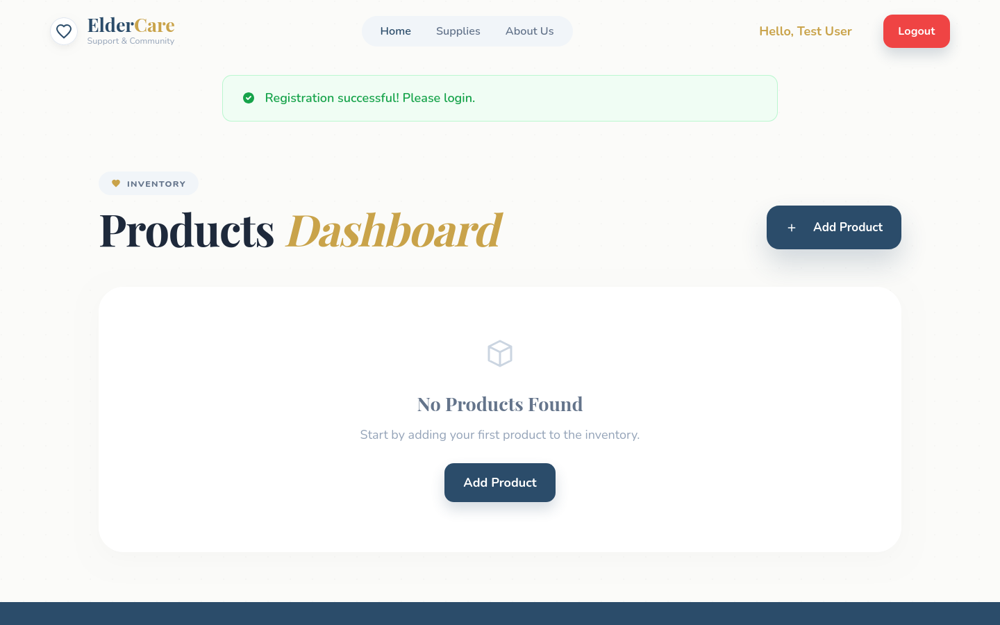
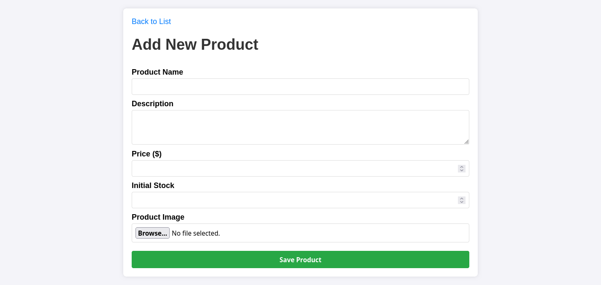

# Educational Product Manager

PHP + MySQL web app

Register, login, manage products

---

# What It Does

- Create user accounts
- Login securely
- View product list
- Add, edit, delete products
- Upload product images

---

# User Flow

Register

Login

Manage products

Logout

---

# Login


---

# Login Feedback


---

# Register


---

# Register Result



---

# Products Dashboard


---

# Empty State


---

# Add Product



---

# Product Added


---

# Main Pages

- Login
- Register
- Product list
- Add product
- Edit product

---

# App Entry

```php
require_once 'config/database.php';
require_once 'controllers/LogicController.php';

$controller = new LogicController($conn);

if (session_status() === PHP_SESSION_NONE) {
  session_start();
}

$action = $_GET['action'] ?? 'login';
require_once 'routes.php';
```

One entry point for the whole app

---

# Routing

```php
switch ($action) {
  case 'login': ...
  case 'register': ...
  case 'products': ...
  case 'create_product': ...
  case 'edit_product': ...
  case 'delete_product': ...
  default: ...
}
```

Simple page-based navigation

---

# Login Success

```php
if ($user && password_verify($password, $user['password'])) {
  $_SESSION['user_id'] = $user['id'];
  $_SESSION['user_name'] = $user['name'];
  header("Location: index.php?action=products");
}
```

Session starts the protected area

---

# Product List View

```html
<th>Image</th>
<th>Name</th>
<th>Price</th>
<th>Stock</th>
<th>Actions</th>
```

The dashboard focuses on key product info

---

# AJAX Delete

```js
fetch(`index.php?action=delete_product&id=${id}`, {
  method: "DELETE",
  headers: {
    "X-Requested-With": "XMLHttpRequest",
  },
});
```

Delete without full page refresh

---

# Secure Registration

```php
$hashed_password = password_hash($password, PASSWORD_DEFAULT);
```

Passwords are stored hashed

---

# Database Design

## Products Table

```sql
CREATE TABLE products (
  id INT AUTO_INCREMENT PRIMARY KEY,
  image VARCHAR(255),
  name VARCHAR(100) NOT NULL,
  description TEXT,
  price DECIMAL(10, 2) NOT NULL,
  stock INT NOT NULL,
  created_at TIMESTAMP DEFAULT CURRENT_TIMESTAMP
)
```

Simple schema for product management

---

## Users Table

```sql
CREATE TABLE IF NOT EXISTS users (
  id INT AUTO_INCREMENT PRIMARY KEY,
  name VARCHAR(100) NOT NULL,
  email VARCHAR(100) NOT NULL UNIQUE,
  password VARCHAR(255) NOT NULL,
  birthdate DATE NOT NULL,
  created_at TIMESTAMP DEFAULT CURRENT_TIMESTAMP
)
```

Basic schema for the user profiles

---

# Backend Structure

- `index.php`
- `routes.php`
- `controllers/LogicController.php`
- `modles/User.php`
- `models/Product.php`
- `config/database.php`
- `migrations/*`

---

# Auto Setup

- Creates database if missing
- Runs migrations automatically
- Rebuilds missing tables

Easy first run for demos

---

# Final Takeaway

Small MVC-style PHP project

Focused on authentication and product management

Built to be easy to demonstrate
