<style>
section img {
  display: block;
  margin: 0 auto;
  object-fit: scale-down;
  aspect-ratio: 16/9
}
</style>

# Product Manager

PHP + MySQL web app

Register, login, and manage products

---

# Team members

| الإسم           | الإسم               |
| --------------- | ------------------- |
| ياسين محمد رشاد | أحمد علي أحمد عثمان |
| محمد عادل       | محمد وليد           |
| محمد هرمس       | ادم احمد شوقي       |
| مصطفى خالد      | مروان               |
| بسملة مجدي      | إيناس عبد القادر    |

---

# What It Does

- Create user accounts
- Login securely
- View product list
- Add, edit, delete products
- Upload product images

---

# User Flow

Register

Login

Manage products

Logout

---

# Home Page


---

# About Page

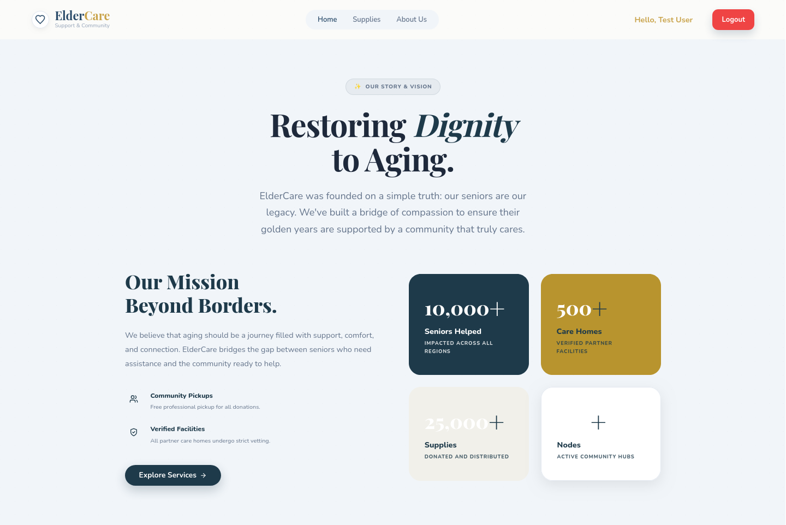

---

# Footer

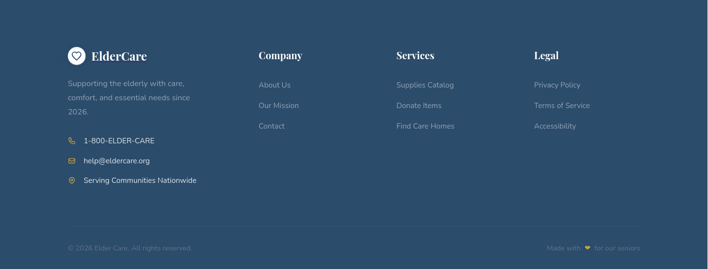

---

# Login

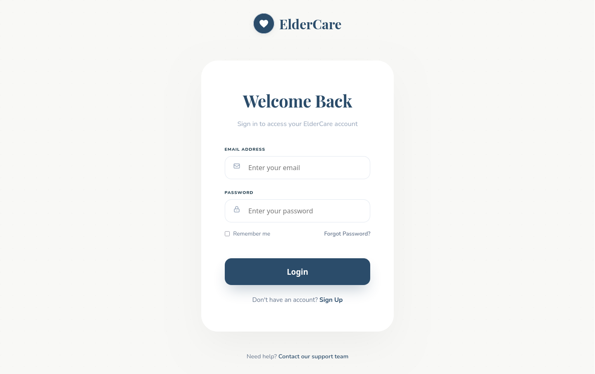

---

# Login Feedback

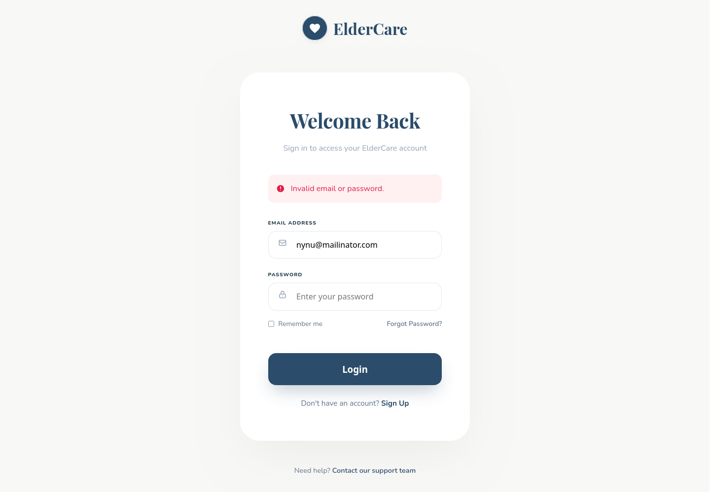

---

# Login Result


---

# Register

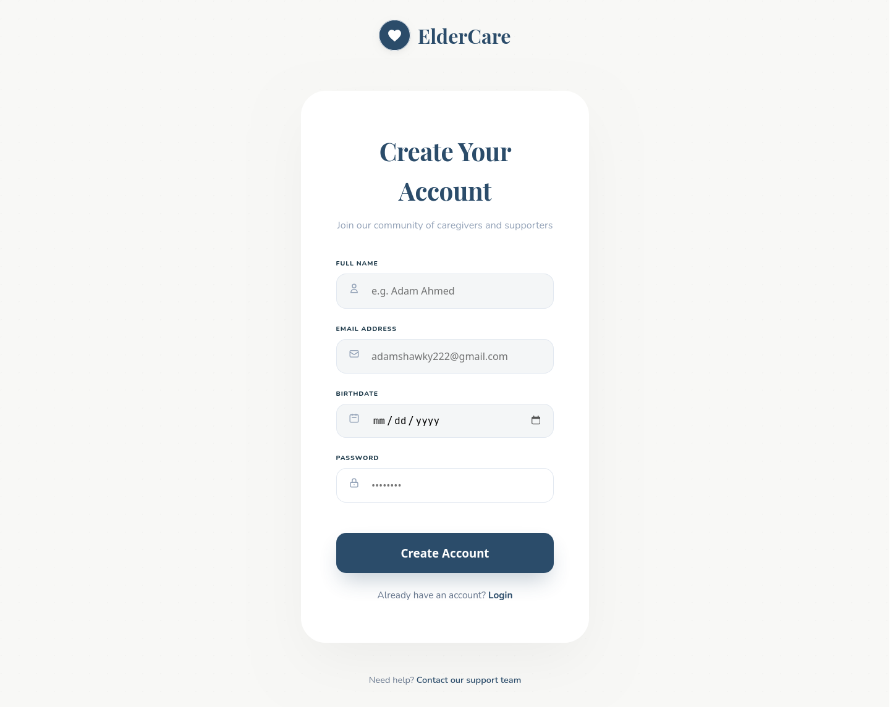

---

# Register Feedback

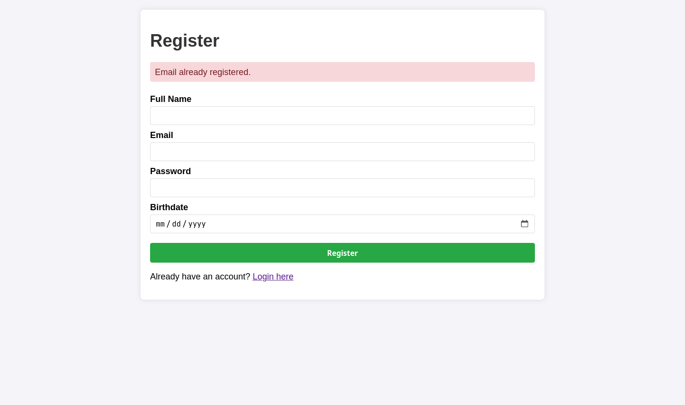

---

# Products Dashboard

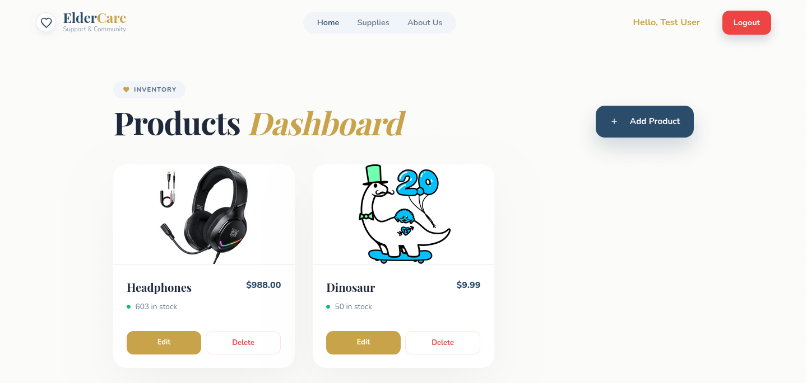

---

# Empty State

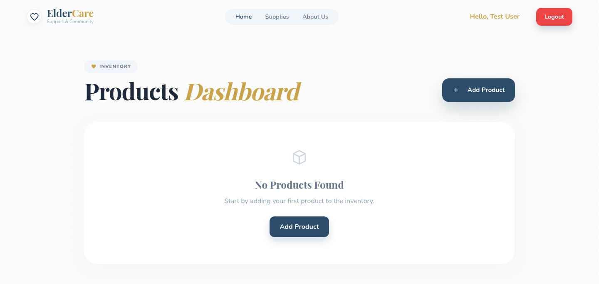

---

# Add Product

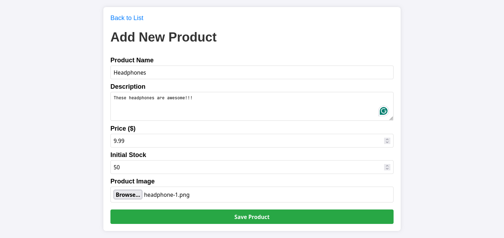

---

# Product Added

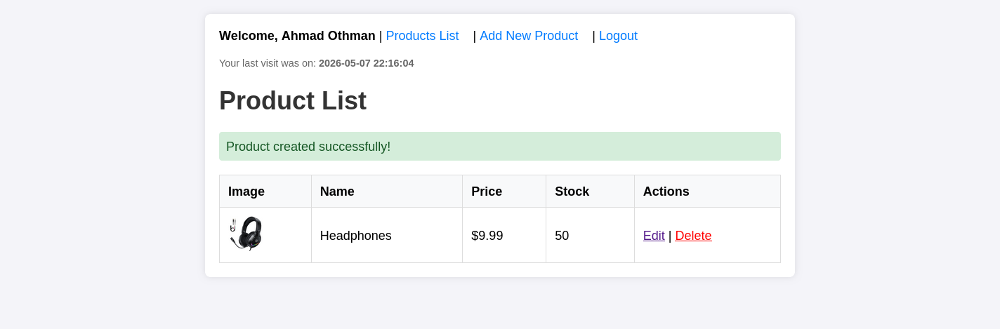

---

# Edit Product

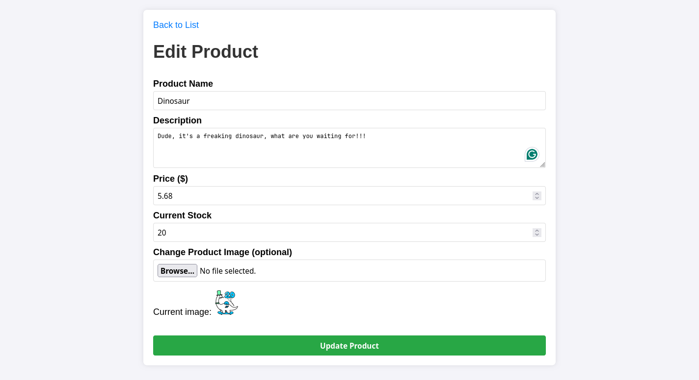

---

# Edit Result

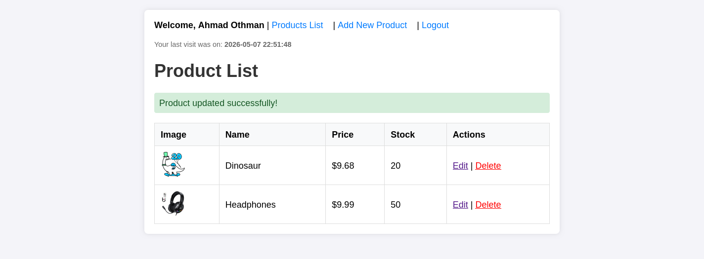

---

# Main Pages

- Home page: landing page for the website
- Login: sign in to access the dashboard
- Register: create a new account
- Product list: browse products and actions
- Add product: create a new item with image
- Edit product: update product details and image
- About page: introduces the project and team
- Footer: shared footer section across pages

---

# App Entry

```php
// Include the database connection and the controller
require_once 'config/database.php';
require_once 'controllers/LogicController.php';

// Initialize the controller
$controller = new LogicController($conn);

// Start the session to handle flash messages and authentication
if (session_status() === PHP_SESSION_NONE) {
  session_start();
}

// We use the 'action' parameter in the URL to determine what the user wants to do.
// Example: index.php?action=products
$action = $_GET['action'] ?? 'login';

require_once 'routes.php';
```

One entry point for the whole app

---

# Routing

```php
switch ($action) {
  case 'login': ...
  case 'register': ...
  case 'logout': ...
  case 'products': ...
  case 'create_product': ...
  case 'edit_product': ...
  case 'delete_product': ...
  case 'home': ...
  case 'about': ...
  default: ...
}
```

Simple page-based navigation

---

# Login Process

```php
$email = $_POST['email'];
$password = $_POST['password'];

$user = $this->userModel->findByEmail($email);

if ($user && password_verify($password, $user['password'])) {
  $_SESSION['user_id'] = $user['id'];
  $_SESSION['user_name'] = $user['name'];
  header("Location: index.php?action=products");
  exit();
} else {
  $_SESSION['error'] = "Invalid email or password.";
  header("Location: index.php?action=login");
  exit();
}
```

Session starts the protected area

---

# Product List View

- Shows image, name, price, and stock
- Each row has edit and delete actions
- This is the main dashboard after login

---

# AJAX Delete

```js
fetch(`index.php?action=delete_product&id=${id}`, {
  method: "DELETE",
  headers: {
    "X-Requested-With": "XMLHttpRequest",
  },
})
  .then(response => response.json())
  .then(data => {
    if (data.success) {
      document.getElementById(`product-card-${id}`)?.remove();
    }
  });
```

Delete without full page refresh

---

# Secure Registration

```php
$hashed_password = password_hash($password, PASSWORD_DEFAULT);
```

- Passwords are not saved as plain text
- Login verifies the hash securely
- Registration also checks for duplicate emails
- Basic validation stops empty form submission

---

# Database Design

## Products Table

```sql
CREATE TABLE products (
  id INT AUTO_INCREMENT PRIMARY KEY,
  image VARCHAR(255),
  name VARCHAR(100) NOT NULL,
  description TEXT,
  price DECIMAL(10, 2) NOT NULL,
  stock INT NOT NULL,
  created_at TIMESTAMP DEFAULT CURRENT_TIMESTAMP
)
```

Simple schema for product management

---

## Users Table

```sql
CREATE TABLE IF NOT EXISTS users (
  id INT AUTO_INCREMENT PRIMARY KEY,
  name VARCHAR(100) NOT NULL,
  email VARCHAR(100) NOT NULL UNIQUE,
  password VARCHAR(255) NOT NULL,
  birthdate DATE NOT NULL,
  created_at TIMESTAMP DEFAULT CURRENT_TIMESTAMP
)
```

Basic schema for the user profiles

---

# Backend Structure

- `index.php`: main entry point for every request
- `routes.php`: maps URL actions to pages and logic
- `controllers/LogicController.php`: handles auth and product actions
- `models/User.php`: user registration and lookup
- `models/Product.php`: product CRUD operations
- `config/database.php`: connects to MySQL and auto-runs setup
- `migrations/*`: creates the required database tables

---

# Auto Setup

- Creates database if missing
- Runs migrations automatically
- Rebuilds missing tables

Easy first run for demos

---

# Final Takeaway

Small MVC-style PHP project

Focused on authentication and product management

Built to be easy to demonstrate
